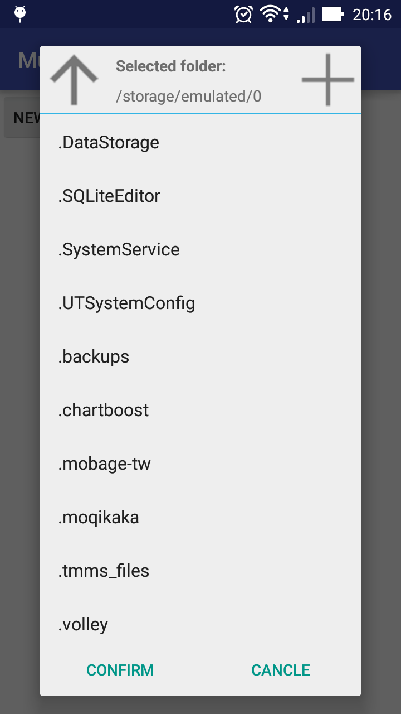

#A simple  directoryChooser on android 

First
```java
        Button but = (Button) view.findViewById(R.id.but);

        final DirectoryChooserConfig config = new DirectoryChooserConfig();
        config.newDirectoryName = "DialogSample";

        final DirectoryChooserFragment mDialog = DirectoryChooserFragment.newInstance(config);

        final Fragment thisfragment = this;

        but.setOnClickListener(new View.OnClickListener() {
            @Override
            public void onClick(View v) {
                mDialog.setTargetFragment(thisfragment, 0);
                mDialog.show(getFragmentManager(), "DirectoryChooserFragment");
            }
        });
```
Second
```java
public class SettingFragment extends Fragment implements
        DirectoryChooserFragment.OnFragmentInteractionListener {
    @Override
    public void onSelectDirectory(@NonNull String path) {
        Log.d("onSelectDirectory", "path:" + path);
        DirectoryChooserFragment fragment = (DirectoryChooserFragment) getFragmentManager().findFragmentByTag("DirectoryChooserFragment");
        fragment.dismiss();
    }

    @Override
    public void onCancelChooser() {
        DirectoryChooserFragment fragment = (DirectoryChooserFragment) getFragmentManager().findFragmentByTag("DirectoryChooserFragment");
        fragment.dismiss();

    }
}
```
Done!
